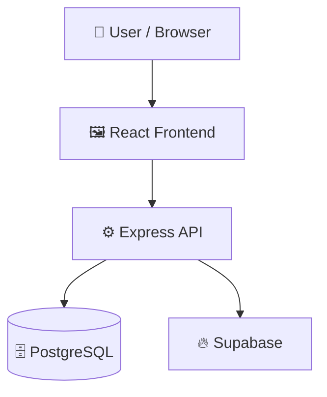

# LKJIV-Forum-registration.public

> Full-stack event registration portal with React and Express API routes.

## 📑 Table of Contents

- [Description](#description)
- [Key Features](#key-features)
- [Use Cases](#use-cases)
- [Tech Stack](#tech-stack)
- [Architecture](#architecture)
- [Quick Start](#quick-start)
- [Key Dependencies](#key-dependencies)
- [Available Scripts](#available-scripts)
- [Project Structure](#project-structure)
- [Development Setup](#development-setup)
- [Contributors](#contributors)
- [Contributing](#contributing)

## 📝 Description

LKJIV-Forum-registration is a full-stack web application built to streamline user registrations for forum events. The application provides a simple web interface paired with a structured REST API backend to manage participant submissions and event details.

## ✨ Key Features

- **⚡ Express REST API Backend** — Exposes structured API endpoints for application health checks, event registration, and date management.
- **⚛️ React Frontend with Vite** — Delivers a responsive client UI using React, TypeScript, React Router, and Vite.
- **🎨 Tailwind CSS Design** — Styles user interfaces using utility-first Tailwind CSS components.
- **🗄️ PostgreSQL Database Layer** — Integrates PostgreSQL and Supabase for persistent data storage and registration management.

## 🎯 Use Cases

- Managing user and attendee registrations for LKJIV forum events.
- Providing a baseline template for Express and React application stacks.

## 🛠️ Tech Stack

      

## 🏗️ Architecture

A high-level view of how the main pieces fit together:



## ⚡ Quick Start

```bash

# 1. Clone the repository
git clone https://github.com/ArthurMagic/LKJIV-Forum-registration.public.git

# 2. Install dependencies
npm install

# 3. Start the dev server
npm run dev
```

## 📦 Key Dependencies

```
@supabase/supabase-js: ^2.111.0
@tailwindcss/vite: ^4.3.3
class-variance-authority: ^0.7.1
clsx: ^2.1.1
cmdk: ^1.1.1
cors: ^2.8.6
dotenv: ^17.4.2
embla-carousel-react: ^8.6.0
express: ^5.2.1
input-otp: ^1.4.2
lucide-react: ^1.25.0
pg: ^8.22.0
radix-ui: ^1.6.4
react: ^19.2.7
react-day-picker: ^10.0.1
```

## 🚀 Available Scripts

- **dev** — `npm run dev`
- **server** — `npm run server`
- **build** — `npm run build`
- **lint** — `npm run lint`
- **preview** — `npm run preview`

## 📁 Project Structure

```
.
├── api
│   ├── db.js
│   ├── routes
│   │   ├── date.js
│   │   ├── health.js
│   │   └── register.js
│   └── server.js
├── eslint.config.js
├── index.html
├── package.json
├── src
│   ├── App.css
│   ├── App.tsx
│   ├── components
│   │   └── ui
│   │       ├── button.tsx
│   │       ├── card.tsx
│   │       ├── checkbox.tsx
│   │       ├── input.tsx
│   │       ├── label.tsx
│   │       ├── separator.tsx
│   │       └── textarea.tsx
│   ├── index.css
│   ├── lib
│   │   └── utils.ts
│   ├── main.tsx
│   └── pages
│       └── participantRegistration.tsx
├── tsconfig.app.json
├── tsconfig.json
├── tsconfig.node.json
└── vite.config.ts
```

## 🛠️ Development Setup

### Node.js / JavaScript
1. Install Node.js (v18+ recommended)
2. Install dependencies: `npm install` (or `yarn` / `pnpm install` / `bun install`)
3. Start the dev server: see the **Quick Start** above

## 👥 Contributors

Thanks to everyone who has contributed to this project:

<p align="left">
<a href="https://github.com/ArthurMagic" title="ArthurMagic"></a>
</p>

[See the full list of contributors →](https://github.com/ArthurMagic/LKJIV-Forum-registration.public/graphs/contributors)

## 👥 Contributing

Contributions are welcome! Here's the standard flow:

1. **Fork** the repository
2. **Clone** your fork: `git clone https://github.com/ArthurMagic/LKJIV-Forum-registration.public.git`
3. **Branch**: `git checkout -b feature/your-feature`
4. **Commit**: `git commit -m 'feat: add some feature'`
5. **Push**: `git push origin feature/your-feature`
6. **Open** a pull request

Please follow the existing code style and include tests for new behavior where applicable.
